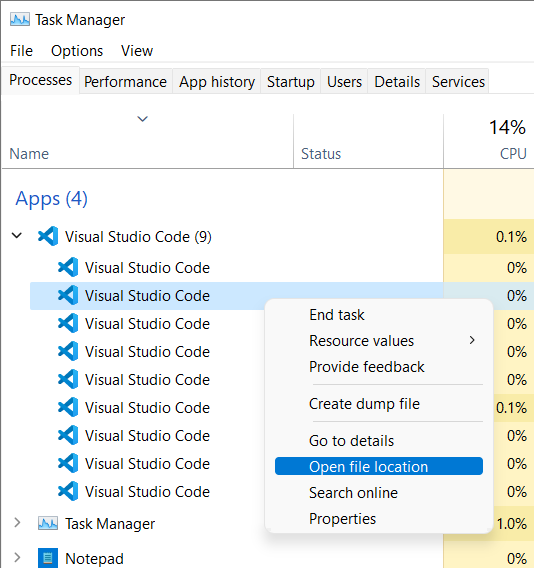
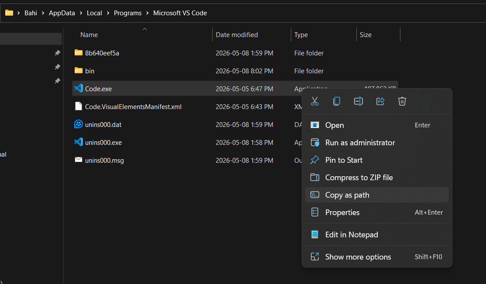
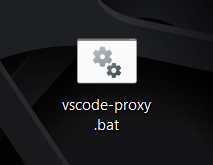
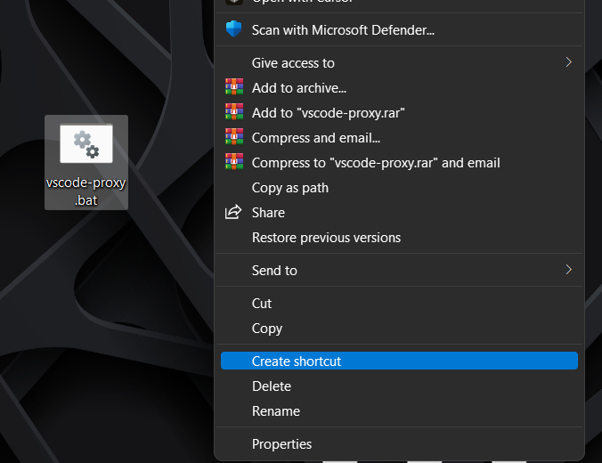
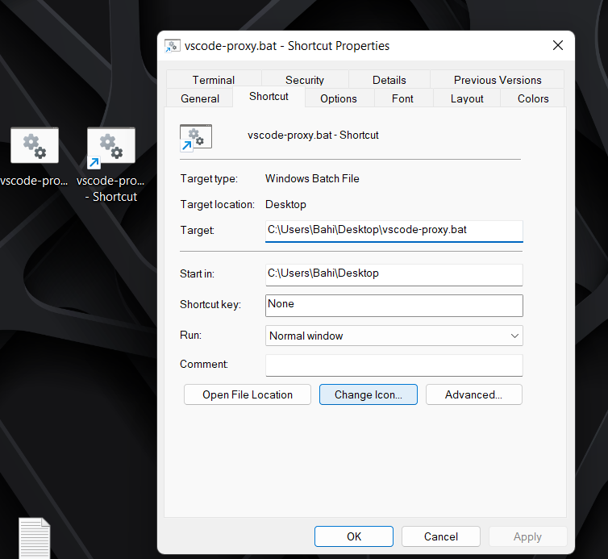
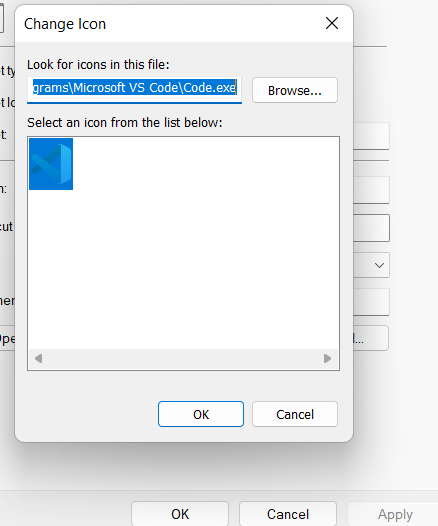
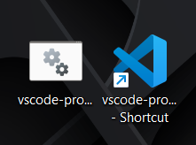
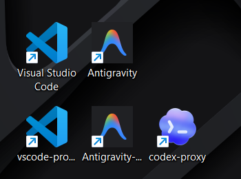

## **0. Connection Credentials**

Before you begin, ensure you have your proxy details ready. We will use these placeholders throughout the guide:

| Variable       | Placeholder    |
| -------------- | -------------- |
| **Proxy IP**   | `<PROXY_IP>`   |
| **Proxy Port** | `<PROXY_PORT>` |
| **Username**   | `<PROXY_USER>` |
| **Password**   | `<PROXY_PASS>` |

---

## **1. Protocol Support: HTTP vs. SOCKS5**

the proxy is built to handle the two most common traffic types in the agentic ecosystem:

- **HTTP/HTTPS:** Best for standard API calls and VS Code extensions.
- **SOCKS5:** Recommended for lower-level terminal tools and applications that require a "cleaner" tunnel without header manipulation.

---

## **2. Integrating with VS Code**

### **The Configuration Method (Not Recomended)**

1. `UI`:

- settings -> application -> proxy
- enter details ("http://<PROXY_USER>:<PROXY_PASS>@<PROXY_IP>:<PROXY_PORT>")
- restart VS Code

2. `settings.json` file

- Open your command palette (`Ctrl+Shift+P`).
- Type `Preferences: Open User Settings (JSON)`.
- Add the following block:

```json
{
  "http.proxy": "http://<PROXY_USER>:<PROXY_PASS>@<PROXY_IP>:<PROXY_PORT>",
  "http.proxyStrictSSL": false,
  "http.proxySupport": "on"
}
```

### **The Injection Method - Terminal Launch (Recommended)**

For deeper integration (ensuring the IDE's internal processes use the proxy), launch VS Code directly from a terminal where the environment is already "poisoned" with your proxy variables.

```bash
# bash shell
# set (in windows cmd for the current session)
# setx (in windows cmd for all sessions)
# export (in linux, mac, bash, zsh, etc.)
# you can replace the http with socks5 if that's what you want to use (in my case i used http)

export HTTP_PROXY="http://<PROXY_USER>:<PROXY_PASS>@<PROXY_IP>:<PROXY_PORT>"
export HTTPS_PROXY="http://<PROXY_USER>:<PROXY_PASS>@<PROXY_IP>:<PROXY_PORT>"
export ALL_PROXY="http://<PROXY_USER>:<PROXY_PASS>@<PROXY_IP>:<PROXY_PORT>"
code .

```

### **The "One-Click" Solution: Custom Launcher (.bat) (Highly Recommended)**

To avoid typing variables every time, create a Windows Batch file. This acts as a dedicated "Proxied VS Code" launcher.

1. Create a file named `vscode-proxy.bat`.

- create it as a `.txt` first and then change the extension to `.bat`

2. Paste the following:

- exmaple for command line prompt (cmd)

```batch
@echo off
echo Injecting Authenticated Proxy into VS Code Environment...

set HTTP_PROXY=http://<PROXY_USER>:<PROXY_PASS>@<PROXY_IP>:<PROXY_PORT>
set HTTPS_PROXY=http://<PROXY_USER>:<PROXY_PASS>@<PROXY_IP>:<PROXY_PORT>
set ALL_PROXY=

start "" "C:\Path\To\Your\Code.exe"

exit
```

**Tip:**: if you don't know the path to Code.exe, Codex.exe or antigravity.exe

- open the app
- open the task manager (`Ctrl` + `Shift` + `Esc`)
- right click on the app and select "Open file location"
  
- it will open the folder where the .exe file is located
- copy the path to the folder and replace `C:\Path\To\Your\Code.exe` with the path to the .exe file in the batch file
  
- make sure to convert the file extension from `.txt` to `.bat` it will be something like this:
  
- press double click to run the app
- it will open a terminal window and then the app with the proxy variables injected automatically
- you can add some extra customizations to the batch file like intilizing specific profile and settings if that's something you want to do.

**Tip**: if you wanna add an icon to the batch file

- right click on the batch file and create a shortcut for it
  
- right click on the shortcut and select "Properties"
- click on "Change Icon"
  
- select an icon (or paste the path to the target app icon you copied earlier and used in the batch file)
  
- click "OK"
- click "Apply"
- click "OK"
- it will change the icon of the batch file to the icon you selected
  
- now you if you lunch the batch file it will use the proxy variables you set in the batch file. and if your lunching the app directly it won't use the proxy variables.

- use can do the same steps with any other apps by changing the app path in the batch file (like Codex, antigravity, etc.) by replacing the "C:\Path\To\Your\Code.exe" with the path to the app you want to run.
- now the first row has the original apps the second row has the proxied apps
  

---

## **3. Powering Codex Desktop & CLI**

The Codex CLI often ignores system-level settings and looks specifically for environment variables.

### **Running Codex from Terminal**

Inject the variables inline to start a proxied session:

```bash
# export word might change if you use another shell
# set (in windows cmd for the current session)
# setx (in windows cmd for all sessions)
# export (in linux, mac, bash, zsh, etc.)
# you can replace the http with socks5 if that's what you want to use (in my case i used http)

export HTTP_PROXY=http://<PROXY_USER>:<PROXY_PASS>@<PROXY_IP>:<PROXY_PORT>
export HTTPS_PROXY=http://<PROXY_USER>:<PROXY_PASS>@<PROXY_IP>:<PROXY_PORT>
export ALL_PROXY=http://<PROXY_USER>:<PROXY_PASS>@<PROXY_IP>:<PROXY_PORT>

codex
```

same for `prodex`

```bash
# bash shell
export HTTP_PROXY=http://<PROXY_USER>:<PROXY_PASS>@<PROXY_IP>:<PROXY_PORT>
export HTTPS_PROXY=http://<PROXY_USER>:<PROXY_PASS>@<PROXY_IP>:<PROXY_PORT>
export ALL_PROXY=http://<PROXY_USER>:<PROXY_PASS>@<PROXY_IP>:<PROXY_PORT>

prodex
```

---

## **4. Developer Productivity: Terminal Aliases**

Don't memorize IPs. Add these to your Shell profile (e.g., `$PROFILE` in PowerShell or `~/.bashrc`) so you can toggle the proxy with one command.

**Bash Example:**

- open bash as an administrator (right click on bash and select "Run as administrator")

```bash
# open your bashrc file with nano editor
nano ~/.bashrc

# add this lines to your bashrc file
# if it ask you to install nano say yes (i used it here as an example of editor)

# Proxy Helper Functions
set-proxy() {
    export http_proxy="http://<PROXY_USER>:<PROXY_PASS>@<PROXY_IP>:<PROXY_PORT>"
    export https_proxy="http://<PROXY_USER>:<PROXY_PASS>@<PROXY_IP>:<PROXY_PORT>"
    echo "Proxy environment variables set."
}

unset-proxy() {
    unset http_proxy
    unset https_proxy
    echo "Proxy environment variables cleared."
}

# save and exit nano (Ctrl + O, Enter, Ctrl + X)
# reopen the terminal
# now you can use the set-proxy command
```

Now, simply typing `set-proxy` in any terminal prepares it for your custom tools.

---
